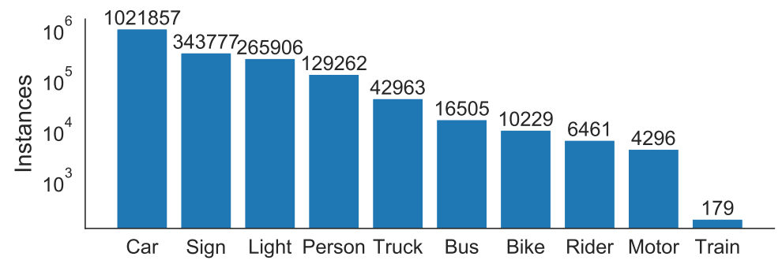

# 基于YOLO11微调BDD100K的目标检测任务

## BDD100K数据集简介

BDD100K 由伯克利AI实验室采集并公开，是一个大规模、多样化的驾驶视频数据集。由 100, 000 (100K) 的视频组成，每个视频大约40秒长，720P， 30fps。涵盖不同天气状况，白天黑夜，晴雨阴天。

该数据集包含以下任务

1. 目标检测 (Object Detection)
2. 车道标记 (Lane Marking)
3. 可行驶区域 (Drivable Area)
4. 语义分割 (Semantic Instance Segmentation)
5. 多目标跟踪 (Multiple Object Tracking)

这里我们只关注目标检测任务。目标检测任务的数据集构建如下：从每个视频的第十秒采样一个关键帧提供注释，也就是说一个100K的标注数据量，分类类别如下：



其中50%的实例被遮挡(occluded)，存在7%的实例被截断(truncated)，


## 数据准备

数据集在 [Index of /bdd100k/data](https://dl.cv.ethz.ch/bdd100k/data/) 下载，数据按照 7：2：1 的比例被分为训练集、验证集和测试集，该来源的测试集没有标注，则只下载 100k_images_train.zip 、 100k_images_val.zip 和 bdd100k_det_20_labels_trainval.zip 三个文件，并按照以下路径放置。

### 格式转换

由于YOLO11要求标注文件按照YOLO自己的格式，而BDD100K的标注也是自己的格式，需要进行转换（该来源下的BDD100K格式似乎同COCO，是训练集和验证集各一个.yml文件）。


```python
import os
import json
from PIL import Image
from collections import OrderedDict
from tqdm import tqdm
from typing import Tuple, Dict, List, Optional

# 配置参数
TRAIN_LABELS_PATH: str = "original_bdd100k_det/det_train.json"
VAL_LABELS_PATH: str = "original_bdd100k_det/det_val.json"
TRAIN_IMAGES_DIR: str = "datasets/bdd100k_det/images/train"
VAL_IMAGES_DIR: str = "datasets/bdd100k_det/images/val"

OUTPUT_TRAIN_LABELS_DIR: str = "datasets/bdd100k_det/labels/train"
OUTPUT_VAL_LABELS_DIR: str = "datasets/bdd100k_det/labels/val"
CUSTOM_YAML_PATH: str = "datasets/bdd100k_det/bdd100K_det_yolo11.yaml"

def convert_bbox(size: Tuple[int, int], box: Dict[str, float]) -> Tuple[float, float, float, float]:
    """
    将边界框从像素坐标转换为相对于图像尺寸的归一化坐标。

    Args:
        size (Tuple[int, int]): 图像的尺寸 (宽度, 高度)。
        box (Dict[str, float]): 包含边界框坐标的字典，格式为 {'x1': float, 'y1': float, 'x2': float, 'y2': float}。

    Returns:
        Tuple[float, float, float, float]: 归一化后的 (x_center, y_center, width, height)。
    """
    dw: float = 1.0 / size[0]
    dh: float = 1.0 / size[1]
    x_center: float = (box['x1'] + box['x2']) / 2.0
    y_center: float = (box['y1'] + box['y2']) / 2.0
    width: float = box['x2'] - box['x1']
    height: float = box['y2'] - box['y1']

    x_center *= dw
    width *= dw
    y_center *= dh
    height *= dh

    return x_center, y_center, width, height


def process_annotations(json_file: str, images_dir: str, output_dir: str) -> None:
    """
    处理JSON格式的注释文件，将其转换为YOLO格式的标签文件。
    即使缺少标签，也会创建一个空的标签文件以保持数据完整性。

    Args:
        json_file (str): 注释JSON文件的路径。
        images_dir (str): 对应图像文件所在的目录。
        output_dir (str): 转换后YOLO标签文件的输出目录。
    """
    global class_mapping

    # 创建输出目录（如果不存在）
    if not os.path.exists(output_dir):
        os.makedirs(output_dir)

    # 读取JSON注释文件
    try:
        with open(json_file, 'r') as f:
            data = json.load(f)
    except json.JSONDecodeError as e:
        print(f"无法解析 JSON 文件 {json_file}: {e}")
        return
    except FileNotFoundError:
        print(f"JSON 文件未找到: {json_file}")
        return

    # 使用 tqdm 显示处理进度
    for item in tqdm(data, desc=f"Processing {os.path.basename(json_file)}"):
        image_name: Optional[str] = item.get('name')
        if image_name is None:
            print("缺少 'name' 键，跳过此项。")
            continue

        image_path: str = os.path.join(images_dir, image_name)

        # 检查图像文件是否存在
        if not os.path.exists(image_path):
            print(f"图片不存在: {image_path}")
            continue

        # 获取图像尺寸
        try:
            with Image.open(image_path) as img:
                width, height = img.size
        except Exception as e:
            print(f"无法打开图像 {image_path}: {e}")
            continue

        # 构建标签文件路径
        label_filename: str = os.path.splitext(image_name)[0] + '.txt'
        label_path: str = os.path.join(output_dir, label_filename)

        # 获取 'labels' 键，可能为 None
        labels: Optional[List[Dict]] = item.get('labels')

        # 打开标签文件，无论是否有标签
        try:
            with open(label_path, 'w') as label_file:
                if labels:
                    for obj in labels:
                        category: Optional[str] = obj.get('category')
                        if category is None:
                            print(f"缺少 'category' 键的对象，跳过。")
                            continue

                        # 如果类别未在类映射中，则添加并分配新的ID
                        if category not in class_mapping:
                            class_mapping[category] = len(class_mapping)

                        class_id: int = class_mapping[category]
                        bbox: Optional[Dict[str, float]] = obj.get('box2d')
                        if bbox is None:
                            print(f"缺少 'box2d' 键的对象，跳过。")
                            continue

                        try:
                            x_center, y_center, w, h = convert_bbox((width, height), bbox)
                        except KeyError as e:
                            print(f"边界框数据不完整 {bbox}: 缺少 {e} 键，跳过。")
                            continue

                        # 写入格式: <class_id> <x_center> <y_center> <width> <height>
                        label_file.write(f"{class_id} {x_center:.6f} {y_center:.6f} {w:.6f} {h:.6f}\n")
                # 如果没有标签，创建一个空文件（占位）
                else:
                    pass  # 空文件已被创建
        except Exception as e:
            print(f"无法写入标签文件 {label_path}: {e}")


def generate_custom_yaml(train_img_dir: str, val_img_dir: str, num_classes: int,
                        class_names: List[str], yaml_path: str) -> None:
    """
    生成YOLO所需的配置文件custom.yaml。

    Args:
        train_img_dir (str): 训练图像目录的路径。
        val_img_dir (str): 验证图像目录的路径。
        num_classes (int): 类别数量。
        class_names (List[str]): 类别名称列表。
        yaml_path (str): 输出的YAML文件路径。
    """
    yaml_content: str = f"""train: {os.path.abspath(train_img_dir)}
val: {os.path.abspath(val_img_dir)}

nc: {num_classes}
names: {class_names}
"""

    # 写入YAML文件
    with open(yaml_path, 'w') as f:
        f.write(yaml_content)

    print(f"{yaml_path} 已生成.")
    
def main() -> None:
    """
    主函数，负责处理训练集和验证集的注释文件，并生成YOLO配置文件。
    """
    # 处理训练集注释
    process_annotations(TRAIN_LABELS_PATH, TRAIN_IMAGES_DIR, OUTPUT_TRAIN_LABELS_DIR)

    # 处理验证集注释
    process_annotations(VAL_LABELS_PATH, VAL_IMAGES_DIR, OUTPUT_VAL_LABELS_DIR)

    # 生成custom.yaml配置文件。备注：数据集保证不会出现训练集和验证集类别不一致的情况。
    class_names_list: List[str] = list(class_mapping.keys())
    generate_custom_yaml(
        train_img_dir=TRAIN_IMAGES_DIR,
        val_img_dir=VAL_IMAGES_DIR,
        num_classes=len(class_names_list),
        class_names=class_names_list,
        yaml_path=CUSTOM_YAML_PATH
    )

    print("转换完成。")
    print("类别映射如下：")
    for cls, idx in class_mapping.items():
        print(f"{idx}: {cls}")
        
if __name__ == "__main__":
    main()
```

产生如下类别：

```json
0: traffic light
1: traffic sign
2: car
3: pedestrian
4: bus
5: truck
6: rider
7: bicycle
8: motorcycle
9: train
10: other vehicle
11: other person
12: trailer
```


再把图片和标注按照如下结构组织：


```bash

dataset/
    ├── images/
    │   ├── train/
    │   │   ├── img1.jpg
    │   │   ├── img2.jpg
    │   └── val/
    │       ├── img3.jpg
    │       ├── img4.jpg
    ├── labels/
    │   ├── train/
    │   │   ├── img1.txt
    │   │   ├── img2.txt
    │   └── val/
    │       ├── img3.txt
    │       ├── img4.txt
    └── data.yaml
```

其中的data.yaml如下写：

```yaml
# filename: data.yaml
train: ./dataset/images/train
val: ./dataset/images/val
nc: 13
classes: ['traffic light','traffic sign','car','pedestrian', 'bus','truck','rider','bicycle', 'motorcycle','train','other vehicle','other person','trailer']
```


基于YOLO11m模型进行微调，在NVIDIA GeForce RTX 3090, 24G平台上进行训练，显存占用大概8.5G，一个epoch大概15分钟

### 出现问题

1. 报错 RuntimeError: torch.cat(): expected a non-empty list of Tensors，实质上是下面的问题，会在运行开始时显示，这是由于文件放置位置有误，严格按照上述文件组织即可结局。

```bash
train: Scanning ./image/mchar_train.cache... 0 images, 70000 backgrounds, 0 corrupt: 100%|██████████| 30000/30000 [00:00<?, ?it/s]

WARNING ⚠️ No labels found in ./image/mchar_train.cache, training may not work correctly. See https://docs.ultralytics.com/datasets/detect for dataset formatting guidance.
```


2. 训练集中 `69863 images, 147 backgrounds, 0 corrupt`，有147张图片是 backgrounds，这意味着本身图片没有问题，但是对应的标签可能不存在，或可能是空的。YOLO11本身的策略比较保守，这些图片在训练中仍然会被使用，但是会学习它们是”负样本“，即背景中没有目标。

   在该数据来源中，训练集图像有70000张，但是标注仅有69863条，原因是其中缺失了137条标注，需要手动去删除，使用自动化代码进行操作，我们把这缺失的137张图片剪切到 cut/ 目标下，确认的确是有目标的。

   ```python
   # filename: find_no_labels.py
   import os
   import shutil
   
   # 设置路径（根据你的实际目录修改）
   images_dir = 'dataset/images/train'
   labels_dir = 'dataset/labels/train'
   cut_dir = 'dataset/image/cut'
   
   # 创建 cut 文件夹（如果不存在）
   os.makedirs(cut_dir, exist_ok=True)
   
   # 获取所有图片文件
   image_files = [f for f in os.listdir(images_dir) if f.lower().endswith(('.jpg', '.png'))]
   
   moved = 0
   for img_file in image_files:
       name, _ = os.path.splitext(img_file)
       label_file = os.path.join(labels_dir, name + '.txt')
   
       # 检查对应标签文件是否存在
       if not os.path.exists(label_file):
           # 没有标注，剪切图片
           src_path = os.path.join(images_dir, img_file)
           dst_path = os.path.join(cut_dir, img_file)
           shutil.move(src_path, dst_path)
           moved += 1
   
   print(f"共剪切了 {moved} 张无标注的图片到: {cut_dir}")
   
   ```

   

3. 训练集中删去 137 条无标注的图像之后，还有 10 张图像被视为 backgrounds，检查发现，这 10 张图片就是没有检测到目标（均为黑夜场景，视野内没有目标），是的的确确的 backgrounds， 而非 no labels。我们把这10张图片复制出来验证一下：

   ```python
   # filename: find_backgrounds.py
   import os
   import shutil
   
   # 路径配置（改成你的实际路径）
   images_dir = 'dataset/images/train'
   labels_dir = 'dataset/labels/train'
   copy_dir = 'dataset/images/copy'
   
   # 创建 copy 目录
   os.makedirs(copy_dir, exist_ok=True)
   
   copied = 0
   for label_file in os.listdir(labels_dir):
       label_path = os.path.join(labels_dir, label_file)
   
       # 筛选出空标签文件
       if os.path.getsize(label_path) == 0:
           image_name = os.path.splitext(label_file)[0] + '.jpg'
           image_path = os.path.join(images_dir, image_name)
           if os.path.exists(image_path):
               dst_path = os.path.join(copy_dir, image_name)
               shutil.copy(image_path, dst_path)
               copied += 1
           else:
               print(f"[警告] 找不到对应图片: {image_name}")
   
   print(f"共复制了 {copied} 张标签为空的图片到: {copy_dir}")
   
   ```

   ==确认无误，开始训练==

   

## 训练

```python
# filename: train.py
from ultralytics import YOLO
model = YOLO("yolo11m.pt")
result = model.train(data = "", epochs = 50, device = "0", name = "yolo11m_bdd100k")
```

 ## 预测

```python
# filename: predict.py
from ultralytics import YOLO
model = YOLO("best.pt")
result = model.train(data = "100k/test/*.jpg", save = True, conf = 0.5)
```


# Reference

1. [BDD100K: A Large-scale Diverse Driving Video Database – The Berkeley Artificial Intelligence Research Blog](https://bair.berkeley.edu/blog/2018/05/30/bdd/)
2. [bdd100k/bdd100k: Toolkit of BDD100K Dataset for Heterogeneous Multitask Learning )](https://github.com/bdd100k/bdd100k)
3. [MaoJiayang/yolo_detection](https://github.com/MaoJiayang/yolo_detection/tree/master)
4. [在运行Yolov8时报错RuntimeError: torch.cat(): expected a non-empty list of Tensors的解决方法-CSDN博客](https://blog.csdn.net/m0_73930473/article/details/139249976)
5. [yolov11模型在bdd100k数据集上的应用【代码+数据集+python环境+训练/应用GUI系统】_yolo11 bdd100k-CSDN博客](https://blog.csdn.net/qz1992/article/details/142678947)

